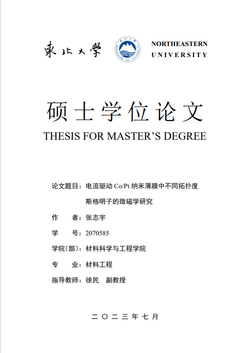

# Northeastern-University-Thesis
用LaTeX写的东北大学材料科学与工程学院硕士学位论文。

第一部分（前言）包括封面、中英文扉页、独创性声明、中英文摘要、目录；

第二部分（正文）包括第一章、第二章（为了显示目录，因此只有标题）、参考文献（部分）；

第三部分（后序）包括致谢、研究成果。

这三部分构成学位论文，其中为了打印方便，需要插入空白页的地方已插入；

为了使页码准确，每一小部分至少包括两页，如目录、参考文献。

LaTeX排版会自动调整，由于第二章只包括许多小标题，因此段落之间的空白很大。

我的第一章后半部分有很多图，文字较少，例如一页出现两个大图，所以图片比较多的时候需要自己在合适的地方插入图片。

最后，单位格式准确且与前后文间距相同，我使用\mySI{}{}在中文段落中插入单位，\SI{}{}在英文段落中插入单位。

